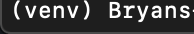

# Installation

## Python

Make sure you have Python 3.7 installed.

You can go to this link to download the latest version of Python: 

[Download Python](https://www.python.org/downloads/)

## Github

Make sure that you have git installed on your machine.

You can check by running the following command on terminal for Mac users and command prompt for Windows users:

    git --version

You should have something like this returned

    git version 2.20.1 (Apple Git-117)

If you get an error that says you don't have git installed, go to this website to download git onto your machine:

[Downloads](https://git-scm.com/downloads)

Once you have git installed, clone the repo to your machine with the following command

    git clone https://github.com/bitprj/bit-backend.git

## Virtual Environment

Move into the darlene-backend directory

    cd darlene-backend

Check to make sure that you have pip installed on you machine with the following command:

    pip --version

If you do not have pip installed, then run the following command:

    sudo easy_install pip

Check if you have virtualenv installed on your machine with the following command:

    virtualenv --version

If you do not have it installed, run the following command:

    pip install virtualenv

Run the following command in darlene-backend to create a virtual environment:

    virtualenv venv

Make sure to run your virtual environment whenever you work on this project:

    source venv/bin/activate

You should see the (venv) next to your terminal name now. This indicates that your working in your virtual environment.

Now run the following command to install all of the dependancies:

    pip install -r requirements.txt

## Environment Variables

Ask Bryan for the env file.