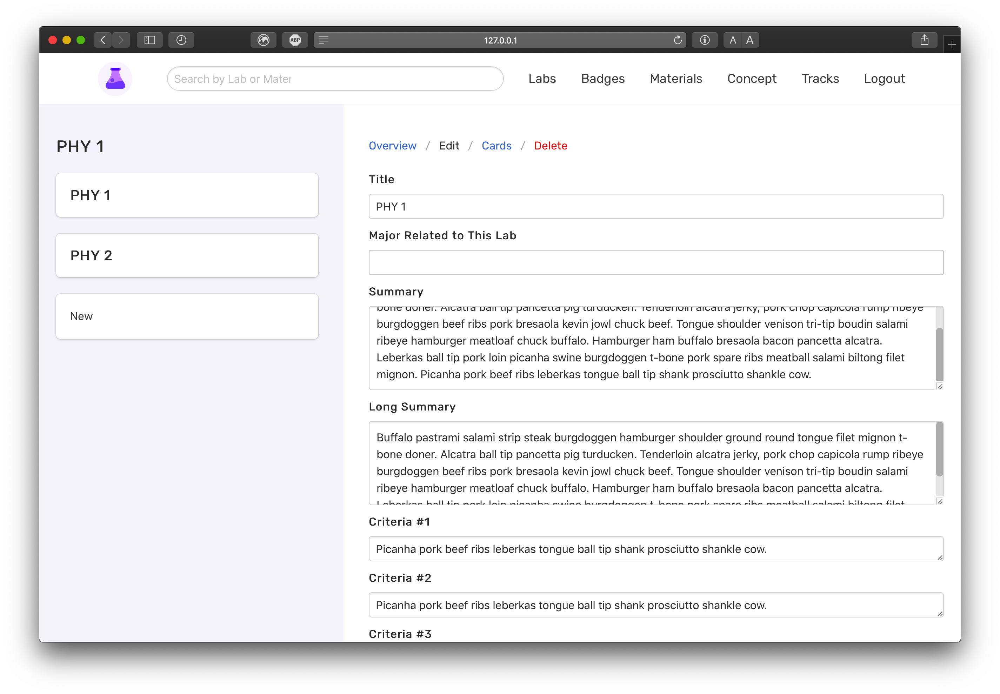

# Activities

Created: Dec 14, 2019 11:49 PM

**Activity Model**

name - name of the activity

contentful_id - id from contentful

**Activity in Contentful**

name - name of activity

description - a brief description about what you do in the activity

summary - a more in depth description about the activity

diffculty - how hard the activity is

image - image of the activity

**GET** FetchActivity - `api.bitproject.org/activities/{{activity_id}}`

This call is used to fetch an activity from the database. It returns, the name, contentful_id, card's name and their contentful_id

    {
        "id": 94,
        "contentful_id": "319Qil9mxQmqJrbZdG1Pho",
        "name": "Activity 3",
        "badge_prereqs": [],
        "cards": [
            {
                "id": 34,
                "contentful_id": "1534akin1MzRJ4QNJBodsk"
            },
            {
                "id": 35,
                "contentful_id": "2kGqNdjGjSSYhzYHICqEv3"
            }
        ]
    }

**POST** CreateActivity - `api.bitproject.org/activities`

This call is used to create a new activity. It takes a webhook from contentful to receive the contentful id.

    {"entityId": "7b15ZKB49F3f5Kd16F9hTN"}

**PUT**  UpdateActivity - `api.bitproject.org/activities`

This call is used to update an existing activity. It receives the contentful id and name of the activity from a wbehook and updates it in the database.

    {
      "entityId": "KnPN3C1yRQyAJoa7fVcCT",
      "spaceId": "aq4puo31m564",
      "parameters": {
        "name": {
          "en-US": "tetst"
        },
        "cards": {
          "en-US": [
            {
              "sys": {
                "type": "Link",
                "linkType": "Entry",
                "id": "7jWJiJVr0AhU4vI6dcoy18"
              }
            },
            {
              "sys": {
                "type": "Link",
                "linkType": "Entry",
                "id": "57BkFz5orvMEOEUgcxPAsy"
              }
            }
          ]
        }
      }
    }

**We use a POST request to delete data from contentful!**

**POST** DeleteActivity - `api.bitproject.org/activities`

This call is used to delete an existing activity. It receives a contentful id from a webhook and deletes it in the backend.

    {"entityId": "7b15ZKB49F3f5Kd16F9hTN"}