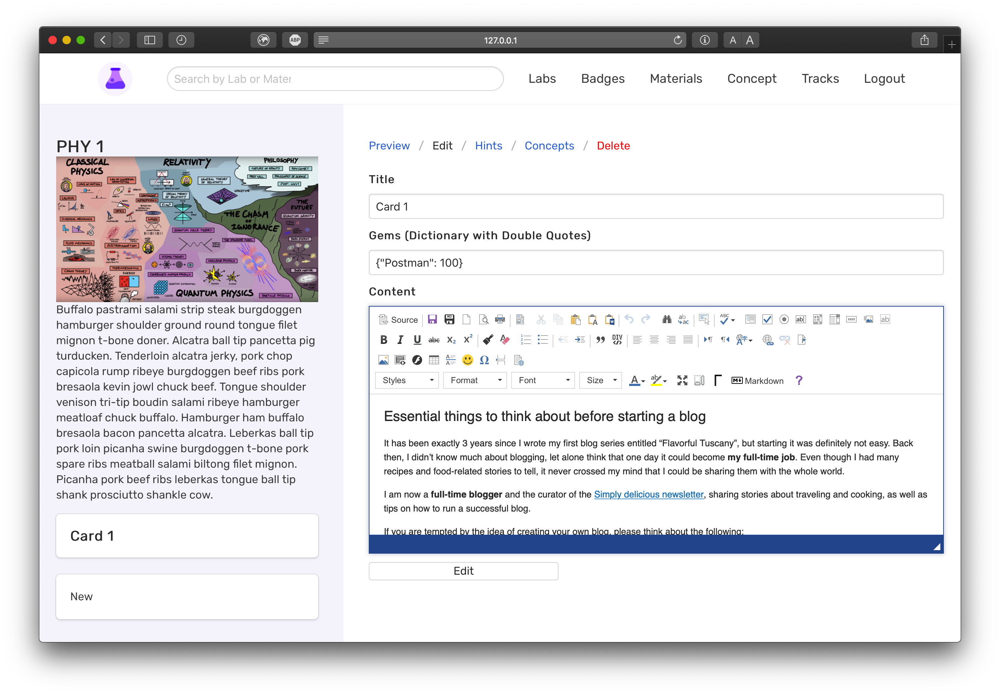

# Cards

Created: Dec 14, 2019 11:50 PM

**Card Model**

name - name of the card

contentful_id - id from contentful

checkpoint_id

checkpoint

**Card in Contentful**

name - name of card

description - a brief description about what you do in the Card

order

checkpoint

hints

concepts

**GET** FetchCard- `api.bitproject.org/cards/{{card_id}}`

This call is used to retrieve a card from the database. It returns the id, contentful_id, hint contentful_ids and concept contentful_ids.

    {
        "id": 5,
        "contentful_id": "3IT5iwCMExO8SOmI6pGuKU",
        "name": "Card 1 ",
        "order": 1,
        "activity": {
            "id": 4,
            "contentful_id": "2jRDfcduwbdAqadXRmznn5"
        },
        "concepts": [
            {
                "id": 3,
                "contentful_id": "6MLF37M8Nu9FiinEYzqrFj"
            }
        ],
        "hints": [
            {
                "id": 8,
                "contentful_id": "6Nc5jXEvfepADEAXspFocd"
            }
        ],
        "checkpoint": {
            "id": 4,
            "contentful_id": "1WQZt7kHxEEGviKatHlZ89"
        }
    }

**POST** CreateCard- `api.bitproject.org/cards`

This call is used to create a new card. Sends the entry id through a webhook from contentful and saves it to the database.

    {
      "entityId": "6f6J2oMdyQ155k6GTCA0DF"
    }

**PUT**  UpdateCard- `api.bitproject.org/cards`

This call is used to update an existing card. Updates the name of the card when updated in contentful.

    {
      "entityId": "1534akin1MzRJ4QNJBodsk",
      "spaceId": "aq4puo31m564",
      "parameters": {
        "name": {
          "en-US": "card 1 act 3"
        },
        "concepts": {
          "en-US": [
            {
              "sys": {
                "type": "Link",
                "linkType": "Entry",
                "id": "pdEfGfhlMnaM4ugn3D7Rd"
              }
            }
          ]
        },
        "hints": {
          "en-US": [
            {
              "sys": {
                "type": "Link",
                "linkType": "Entry",
                "id": "5zrmnacVpYiNqcx2Pmr4m6"
              }
            }
          ]
        }
      }
    }

**We use a POST request to delete data from contentful!**

**POST** DeleteCard - `api.bitproject.org/cards/delete`

This call is used to delete an existing card. Sends the entry id through a webhook from contentful and deletes it in the database.

    {
      "entityId": "6f6J2oMdyQ155k6GTCA0DF"
    }

[More Routes](Cards/More%20Routes.csv)