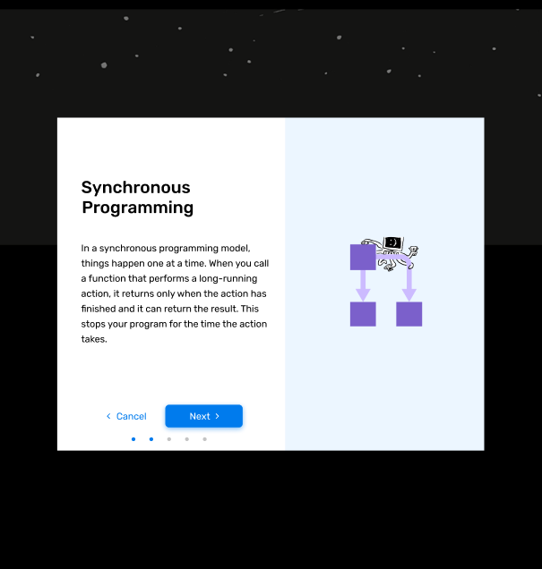

# Concepts

Created: Dec 15, 2019 12:50 AM

This call is used to delete an existing card. Sends the entry id through a webhook from contentful and deletes it in the database.

**Concept Model**

name - name of the concept

contentful_id - id from contentful

**Concept in Contentful**

name - name of concept

steps - the steps of a concept

**GET** FetchConcept- `api.bitproject.org/concepts/{{concept_id}}`

This call is used to retrieve a concept from the database. It returns the id, contentful_id, name, cards contentful_ids and steps contentful_ids.

    {
        "id": 13,
        "contentful_id": "4szkYHUaxjzI9HKeVWs6r1",
        "name": "Delete me :'( ",
        "steps": [
            {
                "id": 53,
                "contentful_id": "UgUffUmv9TUYkzdmjIOQK"
            },
            {
                "id": 54,
                "contentful_id": "7DbF8CUbHLlvSY0tDqz1JT"
            }
        ]
    }

**POST** CreateConcept- `api.bitproject.org/concepts`

This call is used to create a new concept. Sends the entry id through a webhook from contentful and saves it to the database.

    {"entityId": "3bffk3E9oaMrTWOFtSbTxd"}

**PUT** UpdateConcept- `api.bitproject.org/concepts`

This call is used to update an existing concept. Updates the name of the concept when updated in contentful.

    {
      "entityId": "4iTy5lFSQ2SqAfZhIo5Ure",
      "spaceId": "aq4puo31m564",
      "parameters": {
        "name": {
          "en-US": "Concept delete"
        },
        "steps": {
          "en-US": [
            {
              "sys": {
                "type": "Link",
                "linkType": "Entry",
                "id": "3OXBe8R4GWJLywGOOibhDn"
              }
            },
            {
              "sys": {
                "type": "Link",
                "linkType": "Entry",
                "id": "1ZKIlNwSIqyzqqOY5poy9O"
              }
            }
          ]
        }
      }
    }

**We use a POST request to delete data from contentful!**

**POST** DeleteConcept- `api.bitproject.org/concepts/delete`

This call is used to delete an existing concept. Sends the entry id through a webhook from contentful and deletes it in the database.

    {"entityId": "3bffk3E9oaMrTWOFtSbTxd"}