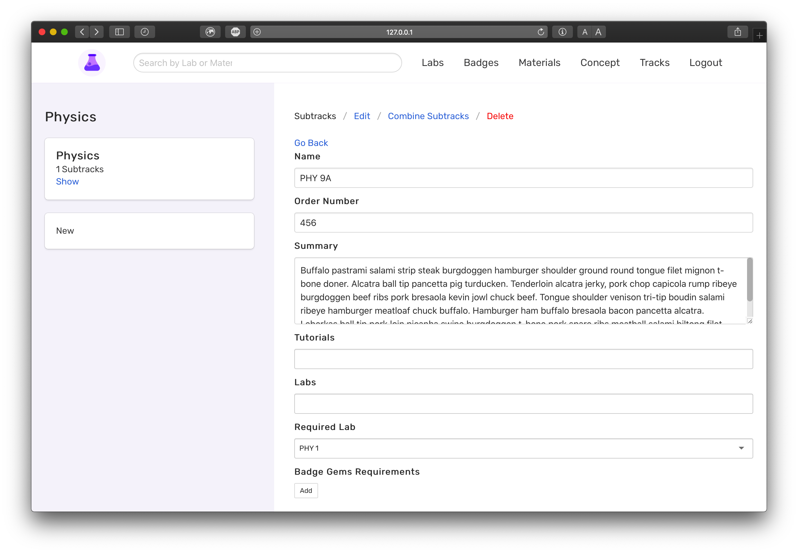

# Modules

Created: Dec 14, 2019 11:49 PM

**Module Model**

github_id - The id that uniquely identifies a module in the tracks.json file on Github. The id is a number

name - Name of the module

description - Something that describes what the module aims to teach a person

gems_needed - Gems needed in order to complete a module

image - An image that represents the module

**GET** FetchModule - `api.bitproject.org/modules/{{module_id}}`

This call is used to fetch a module from the database. It returns the following JSON data.

    {
        "id": 7,
        "name": "Some Module 2",
        "description": "Lorem ipsum dolor sit amet, consectetur adipiscing elit, sed do eiusmod tempor incididunt ut labore et dolore magna aliqua. Ut enim ad minim veniam, quis nostrud exercitation ullamco laboris nisi ut aliquip ex ea commodo consequat. Duis aute irure dolor in reprehenderit in voluptate velit esse cillum dolore eu fugiat nulla pariatur. Excepteur sint occaecat cupidatat non proident, sunt in culpa qui officia deserunt mollit anim id est laborum ",
        "gems_needed": 400,
        "activities": []
    }

**POST** CreateModule - `api.bitproject.org/modules`

This call is used to create a new module. 

To create a Module, add it its [README.md](http://readme.md) file. 

- github_id - The id that uniquely identifies a module
- name - name of the module
- description - a description about the module
- gems_needed - gems needed to complete a module
- image - an image that references an image in the images folder

**Note: If the above parameters are not in the object, then the Module will not be created in the database.**

    {
        "github_id": 4,
        "name": "Some Module 2",
        "description": "Lorem ipsum dolor sit amet, consectetur adipiscing elit, sed do eiusmod tempor incididunt ut labore et dolore magna aliqua. Ut enim ad minim veniam, quis nostrud exercitation ullamco laboris nisi ut aliquip ex ea commodo consequat. Duis aute irure dolor in reprehenderit in voluptate velit esse cillum dolore eu fugiat nulla pariatur. Excepteur sint occaecat cupidatat non proident, sunt in culpa qui officia deserunt mollit anim id est laborum ",
        "gems_needed": 400,
        "activities": []
    }

**PUT**  UpdateModule - `api.bitproject.org/modules`

This call is used to update a module. 

To edit a Module, edit its [README.md](http://readme.md) file. 

- github_id - The id that uniquely identifies a module
- name - name of the module
- description - a description about the module
- gems_needed - gems needed to complete a module

**Note: If the above parameters are not in the object, then the Module will not be updated in the database.**

    {
        "github_id": 4,
        "name": "Some Module and Stuff",
        "description": "Lorem ipsum dolor sit amet, consectetur adipiscing elit, sed do eiusmod tempor incididunt ut labore et dolore magna aliqua. Ut enim ad minim veniam, quis nostrud exercitation ullamco laboris nisi ut aliquip ex ea commodo consequat. Duis aute irure dolor in reprehenderit in voluptate velit esse cillum dolore eu fugiat nulla pariatur. Excepteur sint occaecat cupidatat non proident, sunt in culpa qui officia deserunt mollit anim id est laborum ",
        "gems_needed": 400,
        "activities": []
    }

**DELETE** DeleteModule - `api.bitproject.org/modules`

This call is used to delete an existing module in Github. It expects to receive the github_id to delete the object in the database.

**Note: This call will only be called if the module folder is deleted in Github.**

    {
        "github_id": 4
    }