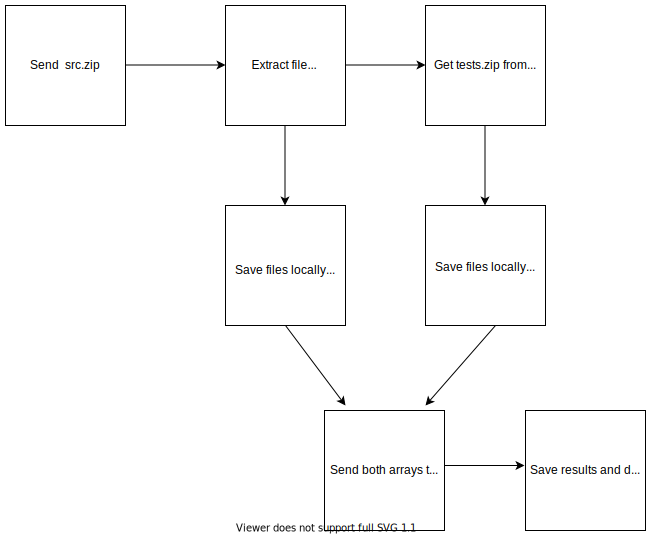

# Autograder

The autograder is used to grade a student's code for a specific activity. To use the autograder, a student can either submit their files in with our CLI or submit their files in a [src.zip](http://src.zip) file by dragging and dropping it to a form on our website. 

The route to call the autograder is [`https://secure-escarpment-83921.heroku](https://secure-escarpment-83921.herokuapp.com/)app.com/uploader`

## Block Diagram

## Extracting Files

When the autograder route is called, a function is called to extract the files in the [src.zip](http://src.zip) file, save the files locally, and stores the filenames in an array called src_names. If the student uses the cli to submit their files, then the route would save the files locally and store the filenames in an array called src_names.

It also takes the [tests.zip](http://tests.zip) file from the checkpoint that the student submitted to. It also extracts the files from the tests.zip file, saves the files locally and saves the filenames in another array called test_names. 

## Running the Autograder

After extracting the test filenames and src filenames, the server would then run the autograder with a function which takes in the test filename array and src filename array. 

Afterwards, the results are returned as a string and we parse it to JSON so that it is easy to read. 

An example of a pass case would look like this:

    {
      "fail_case": {},
      "num_fail": 0,
      "num_pass": 3,
      "pass_cases": [
        {
          "name": "TODO",
          "output": [
            ">>> from thing import *",
            ">>> mult_add(3, 0)",
            "0"
          ]
        },
        {
          "name": "TODO",
          "output": [
            ">>> from thing import *",
            ">>> mult_add(3, -4)",
            "-12"
          ]
        },
        {
          "name": "TODO",
          "output": [
            ">>> from thing import *",
            ">>> mult_add(3, 4)",
            "12"
          ]
        }
      ]
    }

A fail case would look like this:

    {
      "fail_case": {
        "expected": "12\n",
        "name": "TODO",
        "output": "7\n"
      },
      "num_fail": 3,
      "num_pass": 0,
      "pass_cases": []
    }

## Saving the results

When the results are returned, the data gets saved as a submission for the student. That way the 

teachers can look at the student's submission when they are grading a student's activity. Students can look at their submission history if they want to. 

## Pusher

After getting the results, we use an API called Pusher to send the results back to the student, so that they can see them in real time.

## Cleaning up the files

When the grade function is done running the files that the student has submitted gets deleted.